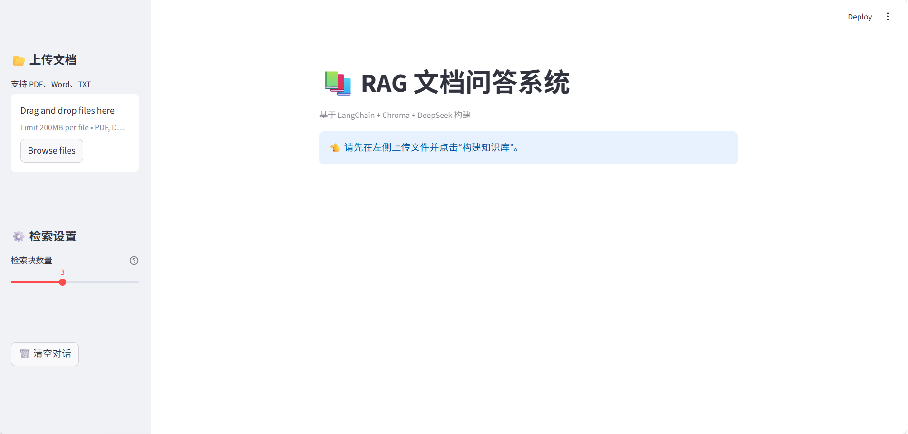
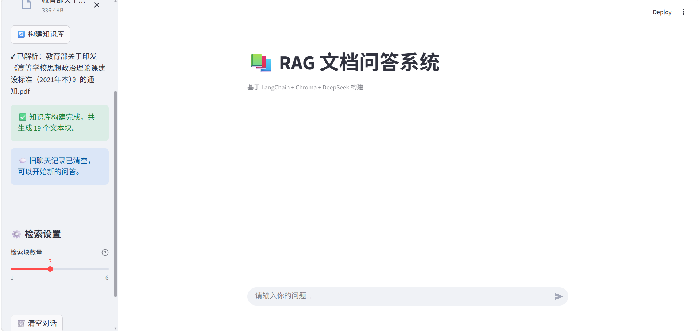
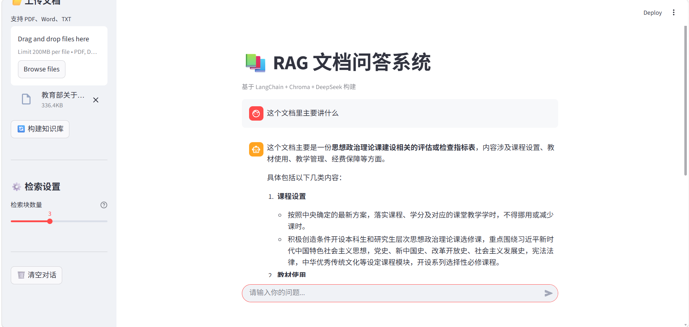
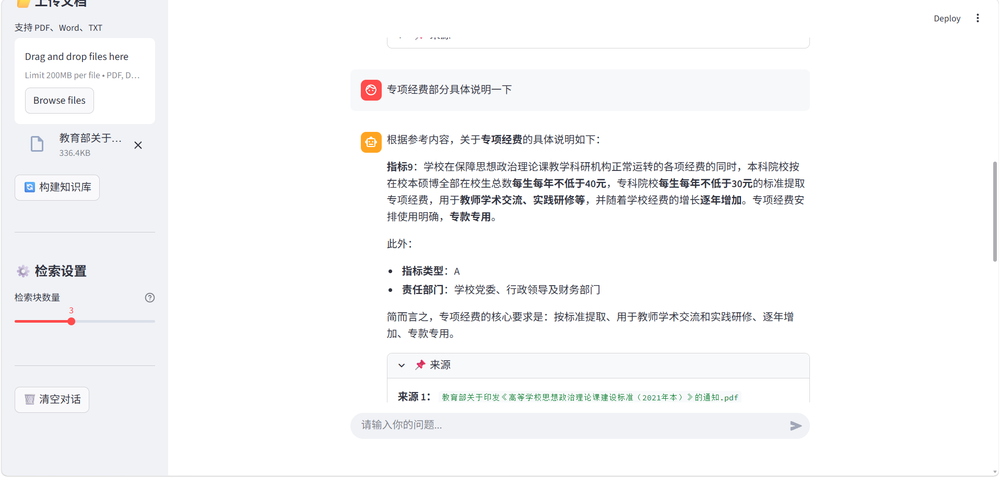
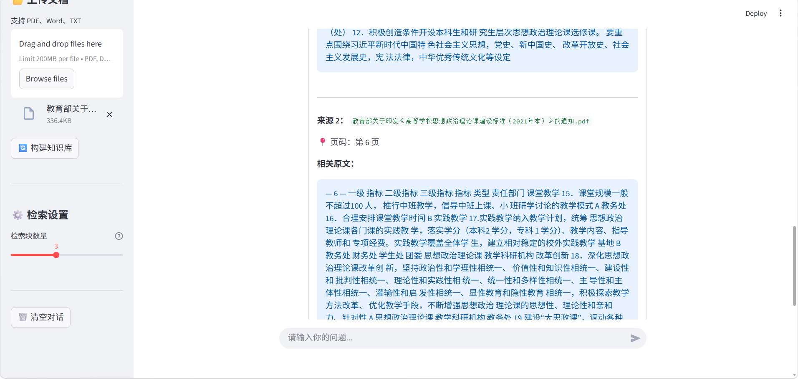
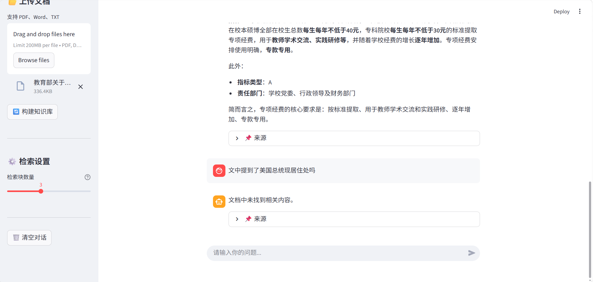
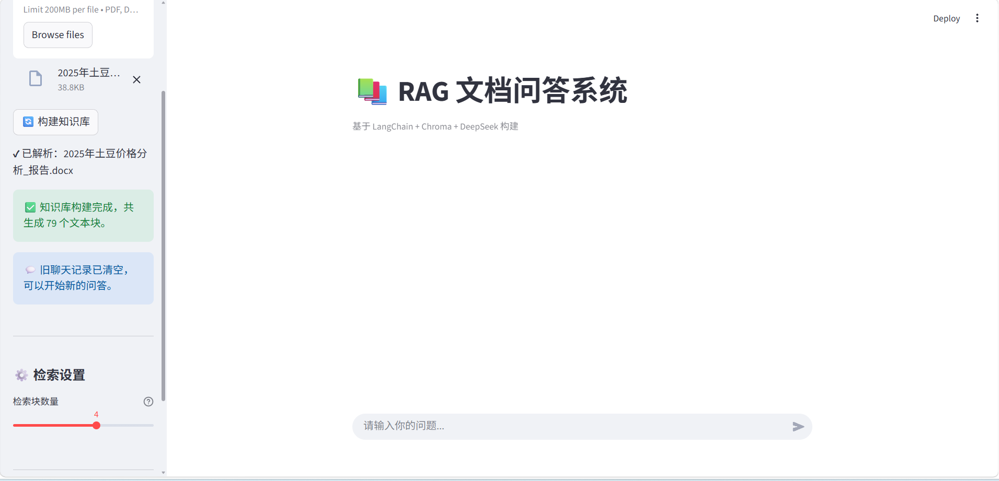

# RAG 文档问答系统

一个基于 **LangChain、Chroma 和 DeepSeek** 构建的 RAG（检索增强生成）文档问答系统。用户可以上传 PDF、Word 和 TXT 文档，构建知识库，并围绕文档内容进行提问。系统会检索相关文本作为回答依据，同时展示相关来源，方便用户核对。

## 功能展示

### 1. 系统首页与多格式文档上传

系统支持上传 PDF、Word（`.docx`）和 TXT 格式的文档。首页提供文档上传区域、检索设置和聊天问答区域。



### 2. 构建知识库与动态调整检索数量

上传文档后，点击“构建知识库”，系统会解析文档内容、切分文本，并将文本向量存入 Chroma 向量数据库。用户还可以通过侧边栏的滑块动态调整检索块数量，以控制每次提问时取回的文本块数量。



### 3. 基于文档内容进行问答

知识库构建完成后，用户可以输入问题。系统先从已上传文档中检索相关内容，再将检索到的参考内容交给 DeepSeek 生成回答。



### 4. 支持连续追问与多轮对话

系统会保留当前会话中的聊天记录，并在后续提问时传入对话历史。用户可以围绕前面的问题继续追问，进行连续交流。



### 5. 展示回答来源与相关原文

回答下方可以展开“来源”区域，查看相关文件名、页码或文本位置标记，以及检索到的原文片段，便于核对回答依据。



### 6. 对文档中没有依据的问题进行测试

系统提示词要求回答严格依据检索到的参考内容；如果参考内容无法回答问题，应提示“文档中未找到相关内容”。该截图展示了对不相关或文档中没有依据的问题进行测试的结果。



> 说明：该行为依赖检索结果和生成模型对提示词的遵循情况，实际效果应以运行测试为准。

### 7. 重新构建知识库

上传新文档并重新构建后，系统会为本次构建创建新的 Chroma collection，并将其设置为当前会话使用的知识库。这样可以避免后续检索继续使用上一次构建的知识库内容。



## 技术栈

- **Python**：项目开发语言
- **Streamlit**：Web 交互界面
- **LangChain**：文档处理、文本切分与 Embedding 接入
- **Chroma**：向量存储与相似度检索
- **Hugging Face Sentence Transformers**：本地 Embedding 模型
- **DeepSeek API**：根据检索到的参考内容生成回答
- **PyMuPDF**：PDF 文档解析
- **python-docx**：Word 文档解析

## 系统工作流程

1. 上传 PDF、DOCX 或 TXT 文档。
2. 解析文档并提取文本内容。
3. 使用文本切分器将内容切分为文本块。
4. 使用 Embedding 模型将文本块转换为向量。
5. 将文本块及其向量存储到 Chroma。
6. 用户提问后，系统检索相关文本块。
7. 将检索结果和聊天历史整理为提示内容，调用 DeepSeek 生成回答。
8. 展示回答及相关来源，供用户核对。

## 运行环境与配置

运行前需要准备 Python 环境，并安装项目所需依赖。项目还需要配置 DeepSeek API Key。

在项目根目录创建 `.env` 文件，并配置：

```env
DEEPSEEK_API_KEY=你的_DEEPSEEK_API_KEY
```

请勿将真实 API Key 提交到公开仓库。建议将 `.env` 加入 `.gitignore`。

## 启动项目

在项目根目录执行：

```bash
python -m streamlit run main.py
```

如果使用指定的 Python 解释器，也可以执行：

```bash
D:\anaconda\python.exe -m streamlit run main.py
```

启动后，按照页面提示上传文档并构建知识库，即可开始问答。

## 项目目录示例

```text
rag/
├── images/
│   ├── 01.png
│   ├── 02.png
│   ├── 03.png
│   ├── 04.png
│   ├── 05.png
│   ├── 06.png
│   └── 07.png
├── main.py
├── .env
└── README.md
```

> 图片使用相对路径引用。请确保 `README.md` 与 `images` 文件夹位于项目根目录，且截图文件名与上面一致。
